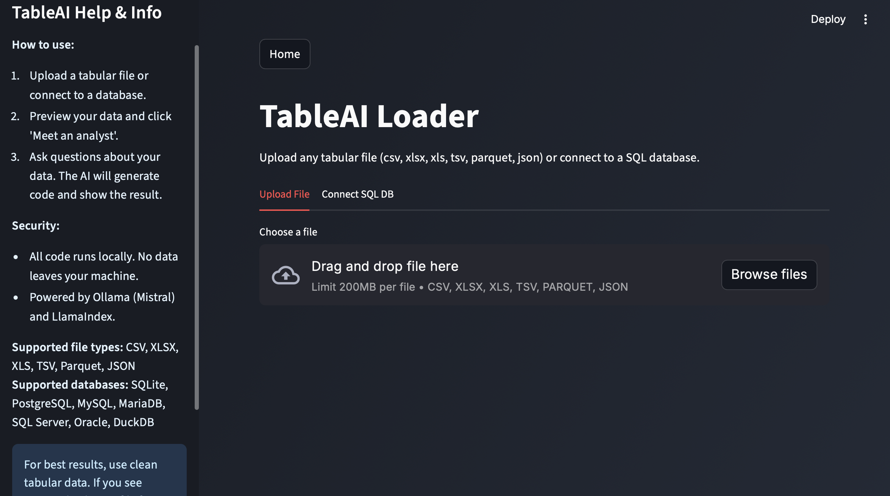
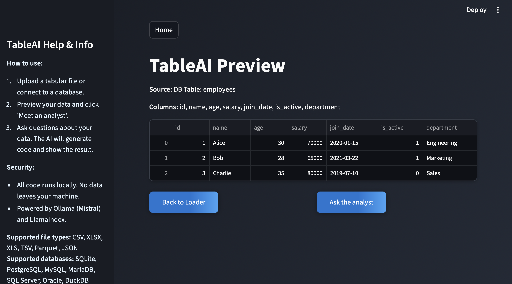
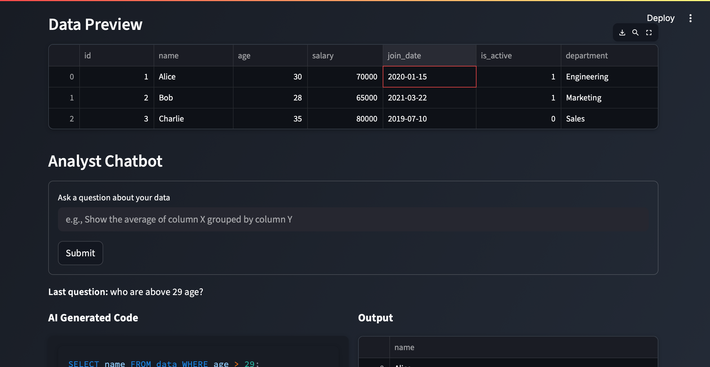

# TableAI: Secure Local Data Analyst

TableAI is a modern, production-ready Streamlit app that lets you analyze sensitive tabular data using a local AI-powered chatbot. All code and data stay on your machine—no cloud, no data leaks. Powered by Ollama (Mistral) and LlamaIndex, TableAI generates and runs Python (pandas) or SQL code to answer your questions, visualize data, and accelerate your analysis workflow.

---

## Features

- **Local-Only AI Chatbot:** No data leaves your machine. All code runs locally using Ollama (Mistral) and LlamaIndex.
- **Multi-Turn Chat:** Ask follow-up questions and refine code with context-aware AI.
- **Dynamic Output:** See highlighted values, tables, and graphs—automatically rendered.
- **Modern UI:** Clean two-column layout, dark theme, custom font, and smooth animations.
- **Robust Error Handling:** Friendly messages and guidance for all edge cases.
- **Code Editing & Running:** Review, edit, and re-run AI-generated code.
- **Supports Files & Databases:** Upload CSV, Excel, TSV, Parquet, JSON, or connect to SQL databases (SQLite, PostgreSQL, MySQL, MariaDB, SQL Server, Oracle, DuckDB).

---

## How It Works

1. **Landing Page:**
   - Upload a tabular file or connect to a database.
   - TableAI supports CSV, XLSX, XLS, TSV, Parquet, JSON, and major SQL databases.

2. **Preview Data:**
   - Instantly preview your data and its columns.
   - Click "Meet an analyst" to start chatting with the AI.

3. **Chatbot Analyst:**
   - Ask questions about your data in plain English.
   - The AI generates code, runs it, and shows the result (with code and output).
   - Edit and re-run code as needed.

---

## Screenshots

1. **Landing Page:**
   
   

2. **Data Preview:**
   
   

3. **Chatbot Analyst:**
   
   

---

## Installation & Setup

### 1. Clone the Repository

```bash
git clone https://github.com/kamalshowgit/TableAI.git
cd TableAI
```

### 2. Create a Virtual Environment (Recommended)

```bash
python3 -m venv venv
source venv/bin/activate
```

### 3. Install Requirements

```bash
pip install -r requirements.txt
```

### 4. Install Ollama & Mistral Model

- **Ollama:** [Install instructions](https://ollama.com/download)
- **Start Ollama:**
  ```bash
  ollama serve
  ```
- **Pull Mistral Model:**
  ```bash
  ollama pull mistral
  ```

### 5. Run the App

```bash
streamlit run app.py
```

The app will open in your browser at [http://localhost:8501](http://localhost:8501).

---

## Documentation

TableAI includes comprehensive documentation that can be viewed locally using Mintlify.

### Running Documentation Locally

1. **Install Node.js** (if not already installed):
   ```bash
   # On macOS with Homebrew
   brew install node
   
   # Or download from https://nodejs.org/
   ```

2. **Install Mintlify CLI globally:**
   ```bash
   npm install -g mintlify
   ```

3. **Start the documentation server:**
   ```bash
   # From the project root directory
   mintlify dev
   ```

4. **View documentation:**
   - Open your browser to the URL shown in the terminal (usually `http://localhost:3000`)
   - Browse through the complete documentation including:
     - Getting Started Guide
     - Feature Documentation
     - API Reference
     - Deployment Guide
     - Troubleshooting

### Documentation Contents

The `docs/` folder contains:
- **Introduction & Quickstart** - Get up and running quickly
- **Feature Guides** - Detailed explanations of AI analyst, data upload, and database connectivity
- **API Reference** - Complete function and method documentation
- **Deployment Guide** - Production deployment strategies
- **Troubleshooting** - Common issues and solutions

---

## Usage

- **Upload Data:** Use the landing page to upload a file or connect to a database.
- **Preview:** Review your data and columns.
- **Chat:** Click "Meet an analyst" and ask questions. The AI will generate code and show results.
- **Edit/Run Code:** Review, edit, and re-run code as needed.
- **Security:** All processing is local. No data or code is sent to the cloud.

---

## Troubleshooting

- **Ollama Not Running:** Make sure `ollama serve` is running in a terminal.
- **Model Not Found:** Run `ollama pull mistral` to download the model.
- **File Errors:** Ensure your file is a supported format and columns are clean.
- **Database Errors:** Double-check your connection string and table selection.
- **Other Issues:** See error messages in the app for guidance.

---

## Contributing

Pull requests and issues are welcome! Please open an issue for bugs or feature requests.

---

## License

MIT License. See [LICENSE](LICENSE) for details.

---

## Credits

- [Streamlit](https://streamlit.io/)
- [LlamaIndex](https://www.llamaindex.ai/)
- [Ollama](https://ollama.com/)
- [Mistral Model](https://ollama.com/library/mistral)

---

## Contact

For questions or support, open an issue or contact [Kamal Soni](https://github.com/kamalshowgit).
